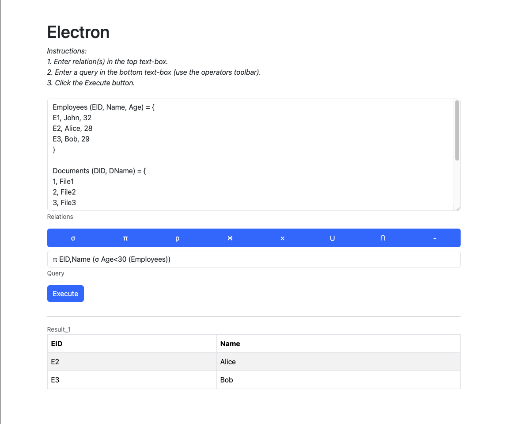

# Electron Relational Algebra Processor

### Description

This project is a web application that enables users to evaluate complex relational algebra expressions. It provides a user-friendly interface for defining relations, inputting queries, and visualizing the results.

### Features



- **Relation Management**: Effortlessly define, edit, and manage relations with attributes and tuples. Supports unary, binary, nested, and complex relations for comprehensive database analysis.
- **Intuitive Query Input**: Utilize a custom syntax for entering relational algebra queries, including support for projection, selection, join operations, and more.
- **Robust Query Evaluation**: Execute queries and view the results in a structured tabular format, allowing for clear interpretation and analysis.
- **Responsive Design**: Experience seamless accessibility across various devices and screen sizes, ensuring a consistent user experience.

### Installation

To get started with this project, clone the repository and install the necessary dependencies:

```bash
git clone https://github.com/OmarAnwar19/Electron-Relational-Algebra-Processor
cd Electron-Relational-Algebra-Processor
npm install
```

### Usage

Live:

- Visit the [Live Project Site]() for a live demonstration of the application.

Locally:

- To run the application, execute the following command: `npm start`
- Navigate to http://localhost:3000 in your web browser to access the application.

### License

This project is licensed under the The MIT License (MIT)

```
Copyright (c) 2015 Chris Kibble

Permission is hereby granted, free of charge, to any person obtaining a copy of this software and associated documentation files (the "Software"), to deal in the Software without restriction, including without limitation the rights to use, copy, modify, merge, publish, distribute, sublicense, and/or sell copies of the Software, and to permit persons to whom the Software is furnished to do so, subject to the following conditions:

The above copyright notice and this permission notice shall be included in all copies or substantial portions of the Software.

THE SOFTWARE IS PROVIDED "AS IS", WITHOUT WARRANTY OF ANY KIND, EXPRESS OR IMPLIED, INCLUDING BUT NOT LIMITED TO THE WARRANTIES OF MERCHANTABILITY, FITNESS FOR A PARTICULAR PURPOSE AND NONINFRINGEMENT. IN NO EVENT SHALL THE AUTHORS OR COPYRIGHT HOLDERS BE LIABLE FOR ANY CLAIM, DAMAGES OR OTHER LIABILITY, WHETHER IN AN ACTION OF CONTRACT, TORT OR OTHERWISE, ARISING FROM, OUT OF OR IN CONNECTION WITH THE SOFTWARE OR THE USE OR OTHER DEALINGS IN THE SOFTWARE.
```
